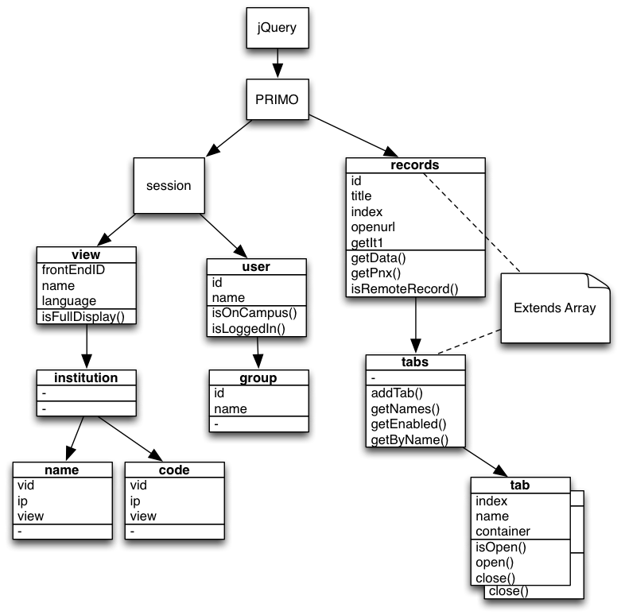

Documentation
=============



Functions will always start with a getXYZ() or an isXYZ() all the rest are properties. Functions pose questions or need to retrieve remote data.
_example:_

Property:
`jQuery.PRIMO.session.user.id;`

Function:
requesting a 
`jQuery.PRIMO.session.isLoggedIn();`


##session

This contains the session data

### user

User data

_properties_
- id
- name

_functions_
- isLoggedIn()
- isOnCampus()

### view

Current view data

_properties_

- frontEndID
> The ID of the frontend that rendered the view

To make this work you need to create a `urlrewrite.xml` file in the `fe_web/WEB_INF` directory
and add this rule to the file.

```xml
<?xml version="1.0" encoding="utf-8"?>
<!DOCTYPE urlrewrite PUBLIC "-//tuckey.org//DTD UrlRewrite 3.1//EN" "http://www.tuckey.org/res/dtds/urlrewrite3.1.dtd">

<urlrewrite>
 <rule>
  <from>.*</from>
  <set type="response-header" name="X-PRIMO-FE-ENVIRONMENT">1</set>
 </rule>
</urlrewrite>
```

The above example will return X-PRIMO-FE-ENVIRONMENT=1 in the response header for every file.

```text
GET /primo_library/libweb/images/icon_book.png

Accept-Ranges	bytes
Content-Length	1202
Content-Type	image/png
...
X-PRIMO-FE-ENVIRONMENT	1
```

- name
> current view code
- language
> current view language

_functions_

#### institution
##### name
_properties_

- vid
- ip
- view

##### code
_properties_

- vid
- ip
- view 

## records
This class extends the Array Object with the next attributes and methods.
### tabs

#### tab


 * @property {object} session                               - session data
 * @property {object} session.view                          - info on current view
 * @property {string} session.view.frontEndID               - frontend id that rendered the view
 * @property {string} session.view.name                     - view name
 * @property {string} session.view.language                 - current view language
 * @property {object} session.view.institution              - institution set to the view
 * @property {object} session.view.institution.name         - institution name
 * @property {string} session.view.institution.name.vid     - institution name according to the VID
 * @property {string} session.view.institution.name.ip      - institution name mapped on user IP
 * @property {string} session.view.institution.name.view    - institution name mapped to user view
 * @property {object} session.view.institution.code         - institution code
 * @property {string} session.view.institution.code.vid     - institution code by VID
 * @property {string} session.view.institution.code.ip      - institution code mapped on user IP
 * @property {string} session.view.institution.code.view    - institution code mapped on user view
 * @method   {boolean} session.view.isFullDisplay           - is the current view in full display mode
 * @property {object} session.user                          - user data
 * @property {string} session.user.id                       - user id
 * @property {string} session.user.name                     - user name
 * @property {object} session.user.group                    - user group
 * @property {string} session.user.group.id                 - group id
 * @property {string} session.user.group.name               - group name
 * @property {boolean} session.user.isOnCampus              - is the user on campus
 * @method   {boolean} session.user.isLoggedIn              - is the user logged in
 * @property {array} records                                - available records